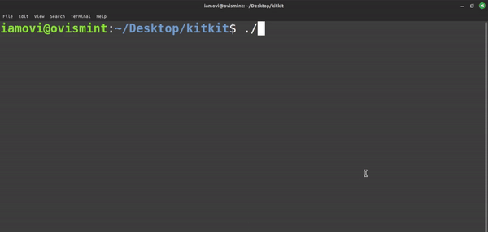

## artcli

This is a command-line interface (CLI) application, allows users to display ASCII art images of various things. The application is written in JavaScript and can be installed globally using npm.

### Prerequisites

Make sure you have Node.js and npm (Node Package Manager) installed on your machine. You can download them from [https://nodejs.org/](https://nodejs.org/).

### Installation

Install artcli globally using the following command:

```bash
npm i -g artcli
```

### Usage

To display an ASCII art image of an animal, open your terminal and run the following command:

```bash
artcli [add_name]
```

Replace [add_name] with the name of the animal you want to see, such as "cat," "dog," or "bunny."

Example - 

```bash
artcli dog
```

Output - 
```bash
    / \__
   (    @\___
   /         O
  /   (_____/
  /_____/   U
```
#### All available ats name gives below - 

```bash

artcli cat

artcli dog

artcli bunny

artcli penguin

artcli gun

artcli f

artcli heart

artcli stars

artcli lol

artcli boring_cat

artcli whatt

artcli drunk

artcli hero

artcli whats_up

artcli love_you

artcli like

artcli cry7

artcli lm10

artcli sigma

artcli mario

artcli lots_of_cats

artcli gun

artcli creamy

artcli roblox

```
- check out [lists.txt](lists.txt) file.

### Contributing

Feel free to contribute to the project by adding more animals or improving the existing code. Create a pull request with your changes, and they will be reviewed.

### Update

Update package is available - 
```bash
npm update -g artcli
```

### Uninstallation

If you ever want to uninstall artcli, you can use the following command:

```bash
npm uninstall -g artcli
```

- but please don't :(

### Cross-Platform Considerations

The core logic of artcli is designed to be cross-platform since it is written in JavaScript and relies on Node.js, which is known for its cross-platform compatibility. However, it's important to note that terminal emulators and environments may have different behaviors on various operating systems.

### License

This project is licensed under the MIT License - see the [LICENSE](LICENSE) file for details.

### Author

[Maruf OVi](https://oviportfo.netlify.app/)

fornet.ovi@gmail.com