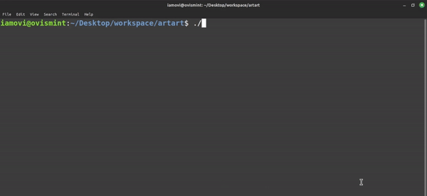

## artart

This is a command-line interface (CLI) application, allows users to display ASCII art images of various things. The application is written in JavaScript and can be installed globally using npm.

### Prerequisites

Make sure you have Node.js and npm (Node Package Manager) installed on your machine. You can download them from [https://nodejs.org/](https://nodejs.org/).

### Installation

Install artart globally using the following command:

```bash
npm i -g artart
```

### Usage

To display an ASCII art image of an animal, open your terminal and run the following command:

```bash
artart [add_name]
```

Replace [add_name] with the name of the animal you want to see, such as "cat," "dog," or "bunny."

Example - 

```bash
artart dog
```

Output - 
```bash
    / \__
   (    @\___
   /         O
  /   (_____/
  /_____/   U
```
#### All available ats name gives below - 

```bash

artart cat

artart dog

artart bunny

artart penguin

artart gun

artart f

artart heart

artart stars

artart lol

artart boring_cat

artart whatt

artart drunk

artart hero

artart whats_up

artart love_you

artart like

artart cry7

artart lm10

artart sigma

artart mario

artart lots_of_cats

artart gun

artart creamy

artart roblox

```
- check out [lists.txt](lists.txt) file.

### Contributing

Feel free to contribute to the project by adding more animals or improving the existing code. Create a pull request with your changes, and they will be reviewed.

### Update

Update package is available - 
```bash
npm update -g artart
```

### Uninstallation

If you ever want to uninstall artart, you can use the following command:

```bash
npm uninstall -g artart
```

- but please don't :(

### Cross-Platform Considerations

The core logic of artart is designed to be cross-platform since it is written in JavaScript and relies on Node.js, which is known for its cross-platform compatibility. However, it's important to note that terminal emulators and environments may have different behaviors on various operating systems.

### License

This project is licensed under the MIT License - see the [LICENSE](LICENSE) file for details.

### Author

[Maruf OVi](https://oviportfo.netlify.app/)

fornet.ovi@gmail.com